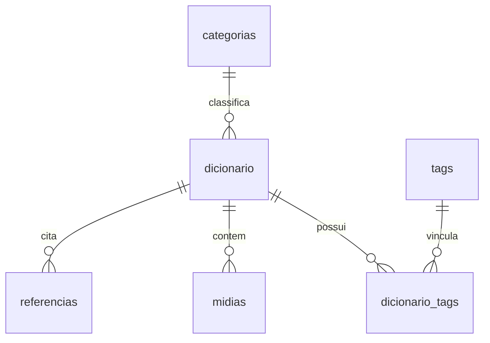
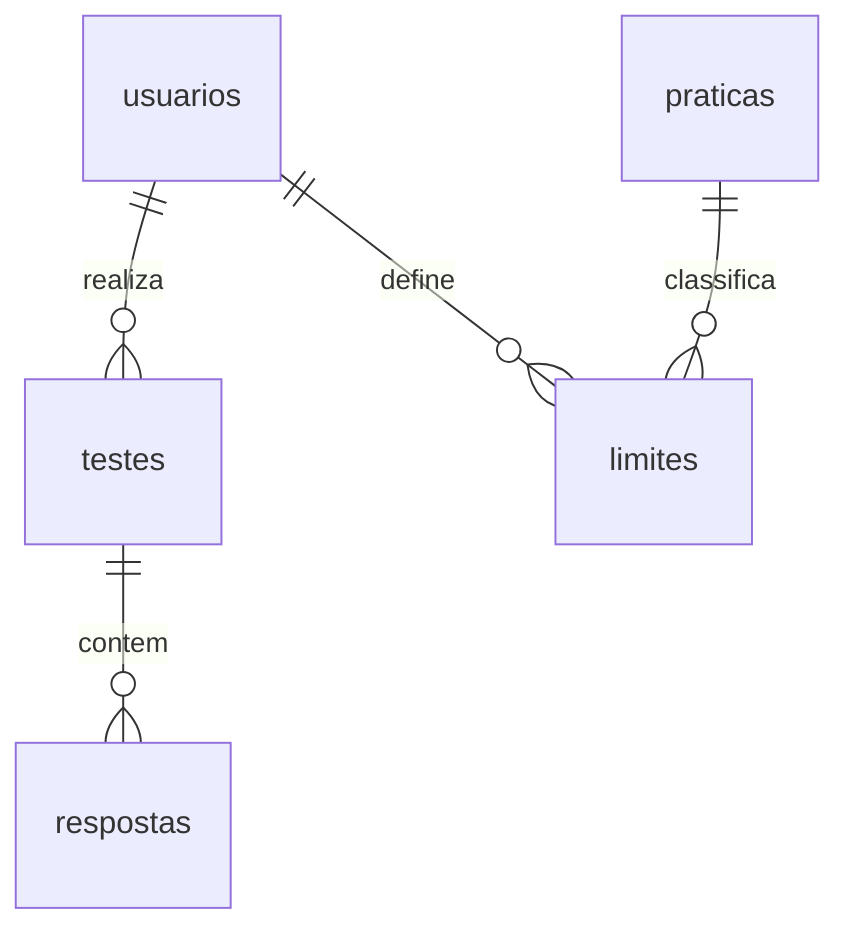

# 💾 Modelagem e Estrutura do Banco de Dados — Nebulosa

Este guia documenta o esquema físico dos bancos de dados SQLite do projeto.

---

## 🛠️ Banco da Wiki (`bdsm_wiki.db`)
Armazena a base de conhecimento de práticas, verbetes do glossário e manuais educativos.

### Principais Tabelas:
1.  **`categorias`**: Armazena as categorias principais da biblioteca (Fundamentos, Segurança, Contenção, etc.).
2.  **`dicionario`**: Glossário de termos com `slug` único para URLs e suporte a descrições longas em markdown.
3.  **`guias`**: Artigos pedagógicos extensivos focados em redução de danos e SSC.

---

## 👥 Banco da Aplicação (`bdsm_completo.db`)
Controle transacional de usuários, fichas cadastrais, testes psicométricos e sinergias consensuais.

### Recursos Avançados:
1.  **`limites`**: Mapeamento do semáforo de consentimento individual de cada usuário (Quero, Talvez, Limite Rígido) com campo de notas personalizadas.
2.  **`relacionamentos`**: Associa díades e casais no sistema.
3.  **`sessoes`** e **`aftercare`**: Controle de segurança de cenas e acompanhamento de Safe Words acionadas.
4.  **`embeddings`**: Preparação nativa para busca semântica orientada por IA em artigos e fetiches.
